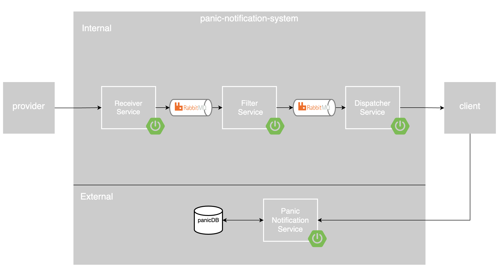

<h1>Panic Notification System</h1>

a notification system utilizes a fast callback mechanism through a message queue in a Microservices setup, ensuring rapid and reliable delivery of alerts for real-time applications.

<h2>Architecture Design</h2>
 

<h2>Database</h2>
 

<h2>Base URLs ☁️ </h2>
Panic Notification Service : https://panic-notification-service-2-69887867641.us-central1.run.app 
//comming soon hopefully 
